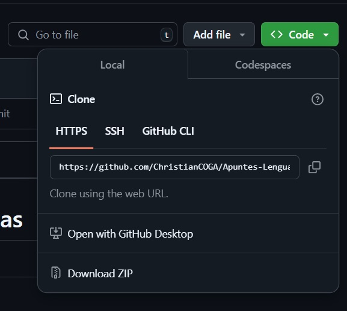

# CobanoGarciaChristian_0373_ASIX1_ApuntesLenguajeMarcas
# LENGUAJES DE MARCAS - ASIX 0373
## INDICE
- [GITHUB](#github)
- [MARKDOWN](#markdown)
- [HTML](#html)
## GITHUB
#### ¿Que és **GITHUB**?
- Portal creado para alojar el código de las aplicaciones de cualquier desarrollador que usaremos especifícamente para crear nuestros repertorios. Estos los tendremos en la nube o *GitHub* los cuales podremos ir copiando y bajando copias a nuestros dispositivos locales así como a la inversa subir las modificaciones hechas en local hacia la nube gracias al *CMD* o a las herramientas de *GitHub*.
- Cada modificación de dicho repertorio lo llamaremos **Commit**.
- Tenemos la posibilidad de alternar en que sean públicos o privados nuestros repertorios.
  - Como puntualización, decir que aunque estén en público nuestros repertorios, siendo estos tomados por su **URL** podrán como mucho copiarlos y modificarlos por su cuenta pero nunca modificar nuestro repertorio.

#### Crear cuenta en GITHUB
-En la página de *GitHub* nos registraremos para permitirnos crear repositorios o colaborar en proyectos ajenos.
#### Repertorios
##### ¿Qué es un repertorio?
Es un lugar o archivo donde puedes almacenar el código, los archivos y el historial de revisiones de cada archivo. Los repositorios pueden contar con múltiples colaboradores y pueden ser públicos como privados.

 Antes de empezar a trabajar en nuestro dispositivo local, deberemos tener en cuenta una serie de comandos de trabajo en **CMD** cada uno con una función específica: 
  - ``git init`` para inicializar el repositorio en nuestro dispositivo local.
  - ``git branch -m "rama"`` para cambiar entre ramas del repositorio. Podemos visualizar las ramas de nuestro repositorio con el comando ``gir branch`` .
  - ``git add + "nombre del archivo"`` para añadir el archivo seleccionado al área intermedia antes de ser subido en nuestro **commit**. Tenemos otro comando ``git add .`` para directamente subir todos los archivos.
  - ``git commit -m + "mensaje/nombre del commit" `` para guardar los cambios que subiremos a posteriori, resepresentara en *GitHub* una actualización del archivo.
  - ``git push origin main`` para enviar el **commit** desde la rama *origen* desde la que trabajamos a la *main* en *GitHub*.
  -  ``git remote add origin + URL`` para clonar un repositorio ajeno o remoto a nuestro dispositivo local.

Ahora si crearemos nuestro repositorio en *GitHub* y nos aseguraremos de copiar la **URL** para poder clonarlo en nuestro sistema.
- En la pestaña **New** crearemos el repositorio.

- Nombraremos el repositorio y lo pondremos en público o privado según preferencia.

- Copiaremos el link del repositorio para añadirlo a nuestro dispositivo local.


- Ahora tendremos que clonarlo en nuestro dispositivo local con el comando:  

Con esto ya podriamos trabajar en local e ir subiendo **commits** según avancemos en nuetsro proyecto para no perder el avance.
## [MARKDOWN](#indice)
Es un lenguaje de marcado ligero creado por **John Gruber** y **Aaron Swartz** que trata de conseguir la máxima legibilidad y facilidad con la aplicación de formato a un texto empleando una serrie de caracteres de una forma especial.

Para poder mostrar nuestro texto de manera organizada como hemos estado viendo en el primer apartado explicaremos los diferentes caracteres y sus aplicaciones:

### - Encabezado
Estos se se diferenciarán según la cantidad de ``##`` que pongamos, es decir, los podremos dividir en subniveles o títulos y subtítulos:
# Título 1
## Título 2
### Título 3
Empleando la siguiente nomenclatura:
```
    # Título 1
    ## Título 2
    ### Título 3 
```    
### - **Negrita** y *Cursiva*
Como se ve en el encabezado, la nomenclatura a seguir será la siguiente:
```
    Negrita : **negrita**
    Cursiva : _cursiva_
```
Comentar que será indiferente que usemos ``*`` o ``
_`` para indicar que sea en negrita o cursiva, se tienen en cuenta la cantidad de caracteres que se escriben para indicar como queremos que se vea la palabra si en **negrita** o **cursiva**.

Añadir que si queremos que sea ambas a la vez, deberemos usar 3 caracteres a cada lado. Palabra en ***cursiva y negrita***
```
    Negrita y cursiva : ***Palabra*** // ___Palabra___
```
### - Listas
Comprende el formato en que se harían las listas en cualquier procesador de texto, ya sea con guión o con numerales:
1. Primero
2. Segundo
3. Tercero
- Título 1
- Título 2
- Título 3
### - Mostar código
La nomenclatura que usaremos pra mostrar el código es mediante el uso de ``` `` ``` y dentro del espacio generado, insertaremos el código que querramos, por ejemplo:
```
    ```
        <!DOCTYPE html>
        <html>
            <body>

            <h1>My first PHP page</h1>

            <?php
            echo "Hello World!";
            ?>

            </body>
        </html>
    ```
```
### - Enlaces
Enlazar una página web en nuestro repositorio se hace de la siguiente manera, copiamos la dirección web y insertaremos la siguiente línea:

```
    [Nombre X](link a la página web // URL)
```

Como ejemplo el link de abajo a la página padre de todos los hobbys.

[Warhammer](https://www.warhammer.com/es-ES/home)

### - Imagenes
Para seleccionar y enseñar una imagen es tan sencillo como descargarla y ubicarla en la carpeta del repositorio donde trabajamos de manera local y inscribir una nomenclatura similar a la de enlace con la siguiente línea:

```
    
```


### - Tablas
 Para la creación de tablas debemos seguir una nomeclatura y orden específico.
 - Crearemos los títulos:
  ```
    |Título 1|Título 2|Título 3|
  ```
- Definiremos los caracteres que podremos escribir en cada columna con el límite de ``-`` que le indiquemos.
- Así mismo también podemos indicar hacía que parte de la tabla queremos que se orienten los campos a rellenar con ``:``.
 ``` 
    |Título 1|Título 2|Título 3|
    |----------|------|----------|
    |:---------|:----:|---------:|
 ``` 
- Quedando como resultado una tabla como la siguiente que por dedecto nos devuelve la tabla con efecto visual **Zebra Stripes**.
    |Capítulo |Unidades|Origen|
    |:---------|:----:|---------:|
    |Templarios Negros|500|Terra|
    |Ultramarines|1500|Ultramar|
## [HTML](#indice)
